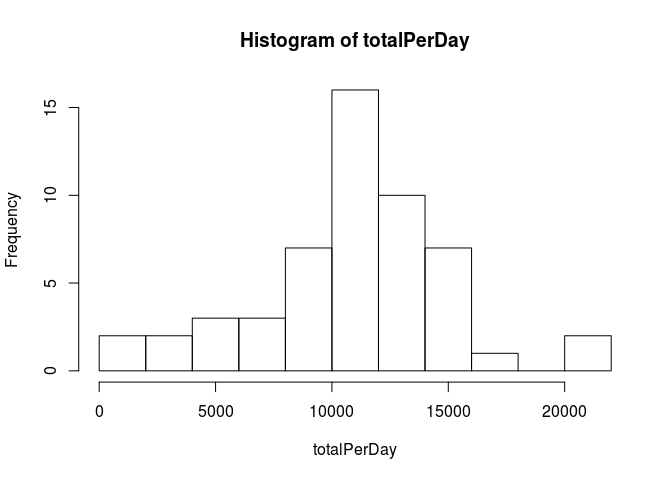
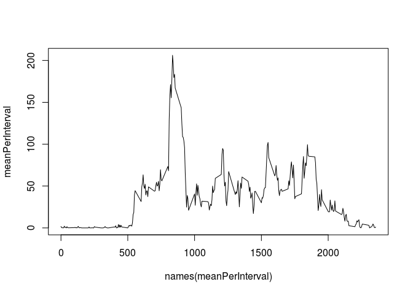
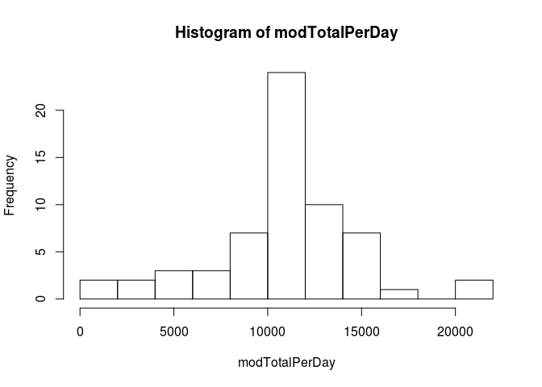
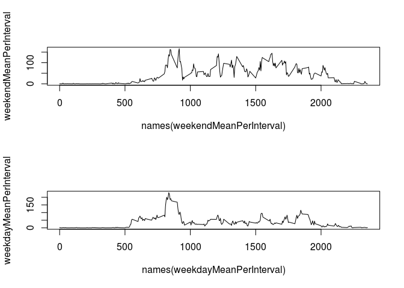

# Reproducible Research: Peer Assessment 1


## Loading and preprocessing the data
Load the data (i.e. read.csv())
Process/transform the data (if necessary) into a format suitable for your analysis

```r
data <- read.csv('activity.csv', header=T)
```


## What is mean total number of steps taken per day?
Calculate the total number of steps taken per day.

```r
totalPerDay <- tapply(data$steps, data$date, sum)
```

Make a histogram of the total number of steps taken each day

```r
totalPerDay <- tapply(data$steps, data$date, sum)
hist(totalPerDay, breaks=10)
```

<!-- -->

Calculate and report the mean and median of the total number of steps taken per day

```r
mean(totalPerDay, na.rm=T)
```

```
## [1] 10766.19
```

```r
median(totalPerDay, na.rm=T)
```

```
## [1] 10765
```


## What is the average daily activity pattern?
Make a time series plot (i.e. type = "l") of the 5-minute interval (x-axis) and the average number of steps taken, averaged across all days (y-axis)

```r
meanPerInterval <- tapply(data$steps, data$interval, mean, na.rm=T)
plot(names(meanPerInterval), meanPerInterval, type = "l")
```

<!-- -->

Which 5-minute interval, on average across all the days in the dataset, contains the maximum number of steps?

```r
names(meanPerInterval[which.max(meanPerInterval)])
```

```
## [1] "835"
```


## Imputing missing values
Calculate and report the total number of missing values in the dataset (i.e. the total number of rows with NAs)

```r
sum(is.na(data$steps))
```

```
## [1] 2304
```

Create a new dataset that is equal to the original dataset but with the missing data filled in.

```r
mod <- data
mod$steps <- as.numeric(apply(mod, 1, function(i) {
  if (is.na(i['steps'])) {
    return(meanPerInterval[trimws(toString(i['interval']))])
  }
  return(i['steps'])
}))
```

Make a histogram of the total number of steps taken each day and Calculate and report the mean and median total number of steps taken per day.

```r
modTotalPerDay <- tapply(mod$steps, mod$date, sum)
hist(modTotalPerDay, breaks=10)
```

<!-- -->

```r
mean(modTotalPerDay)
```

```
## [1] 10766.19
```

```r
median(modTotalPerDay)
```

```
## [1] 10766.19
```

Do these values differ from the estimates from the first part of the assignment?
Yes, slightly  

What is the impact of imputing missing data on the estimates of the total daily number of steps?


## Are there differences in activity patterns between weekdays and weekends?
Create a new factor variable in the dataset with two levels – “weekday” and “weekend” indicating whether a given date is a weekday or weekend day.

```r
mod$isWeekend <- apply(mod, 1, function(i) {
  if (weekdays(as.Date(i['date'])) %in% c('Saturday','Sunday')) {
    return(T)
  }
  return(F)
})
```

Make a panel plot containing a time series plot (i.e. type = "l") of the 5-minute interval (x-axis) and the average number of steps taken, averaged across all weekday days or weekend days (y-axis).

```r
weekend = mod[which(mod$isWeekend),]
weekday = mod[which(!mod$isWeekend),]
weekendMeanPerInterval <- tapply(weekend$steps, weekend$interval, mean)
weekdayMeanPerInterval <- tapply(weekday$steps, weekday$interval, mean)
par(mfrow=c(2,1))
plot(names(weekendMeanPerInterval), weekendMeanPerInterval, type = "l")
plot(names(weekdayMeanPerInterval), weekdayMeanPerInterval, type = "l")
```

<!-- -->
